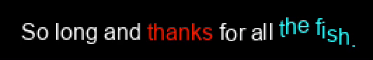

# **Organic Text Engine**
**An easy and customizable text engine for GameMaker**
## **Install**
The text engine comes as a package for GameMaker. Simply create a project, click on the Tools menu, and click *Import Local Package*. Select the *OrganicTextEngine.yymps* file you downloaded.
The package includes an object named ```obj_textengine``` and a script named ```text_engine_print```.
## **Usage**
### **Making Text**
Let's try out the text engine.

First, you'll need to import a font. *Right click the Fonts folder in the asset manager > Create > Font*. Choose any font from your computer. Next, create a room *(make sure it is the first room that opens when you start the game)*. Finally, open the room editor for the room you created, and click *Creation Code*, and type this: *(replace NAME_OF_FONT with the asset name of the font you created)*

    text_engine_print("TEST!", 50, 50, 2, NAME_OF_FONT, c_white, 0, "\n", [], false, 0);

#### **Explanation**
```"TEST!"``` - The text to write

```50, 50``` - The starting X and Y position of the text

```2``` - Text type speed *(Number of frames to wait between letters; lower is faster)*

```NAME_OF_FONT``` - The font for the text

```c_white``` - The color of the text

```0``` - The style of the text *(Go to [**Text Effects**](#text-effects))*

```"\n"``` - The character to use as a newline

```[]``` - The sounds to play when typing the text *(Picked at random from the array)*

```false``` - Advanced text mode *(Go to [**Control Codes**](#control-codes))*

```0``` - Extra data *(Go to [**Text Effects**](#text-effects))*

#### ***Syntax***

    text_engine_print(text, x, y, speed, font, color, style, newlinechar, sounds, advancedtext, extradata);

### **Text Effects**

You can change the ```style``` parameter to create some fancy text! You can use the ```extradata``` parameter to further customize the effect.

|Style number|Name|Extra data|
--- | --- | ---
|0|Normal|N/A
|1|Shaky|Shake amount
|2|Wavy vertical|Wave speed
|3|Wavy horizontal|Wave speed

### **Control Codes**

If the ```advancedtext``` parameter is ```true```, you can use control codes to change the style of your text mid-string. Control codes are enclosed inside square brackets.

|Text|Description|Parameter|
--- | --- | ---
|```style```|Change style|Style number
|```color```|Change text color|Any GameMaker color asset (without the ```c_```)
|```extra```|Change extra data|Any number

You are able to write multiple control codes in one pair of square brackets, like so: ```[color red, style 1]```

#### ***Example***
    text_engine_print("So long and [color red]thanks [color white, style 1]for all [style 2, extra 10, color aqua]the fish.",50,50,2,fnt_arial,2,infinity,c_white,0,"\n",[],true,2);
The code above would look like this:



In the string, ```[color red]``` turns the color to red, ```[color white, style 1]``` changes the color to white and the style to 1 (shaky), and ```[style 2, extra 10, color aqua]``` changes the style to 2 (wavy vertical), the extra data (wave speed) to 10, and the color to aqua.

---

## Credits
Created by [**Chase Peck**](https://chasepeck.com)

[***Organic Games LLC***](https://organic.games)
